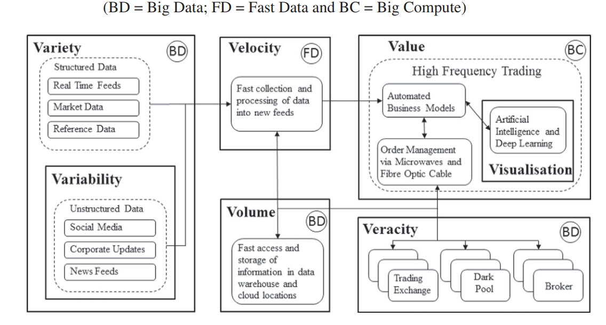
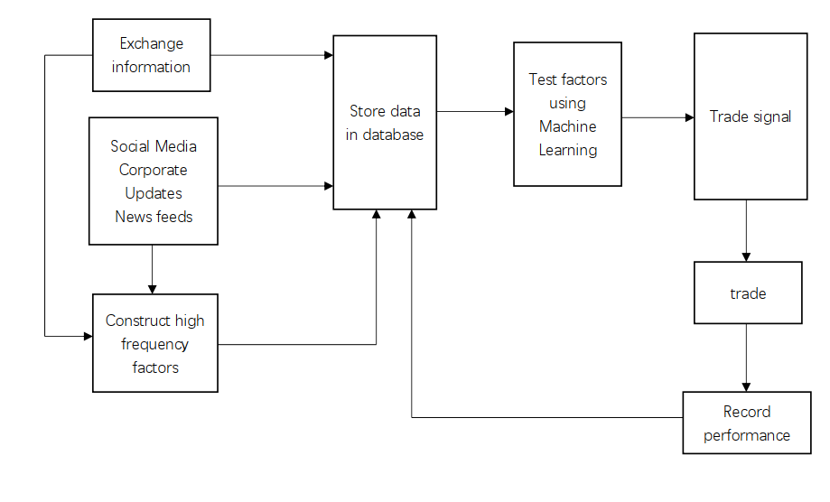

#Homework 1 

## Bigdata in quantitative finance
  Big data in quantitative finance is very popular recently, especially in high frequency trading, such as using high frequency factor
to predict the price movement and algorithm trading. The intrinsic big data properties as follows:
* 

## Workflow
* 

## Database selection
* For structured data like market data and real time feeds, I will choose time series database to store them, such as InfluxDB. Because in this kind of database, time is treated as first class with finest granularity and time-window based operations are highly optimized. Besides, most of exchange information are time series data.
* For social media data or news, I will use the MongoDB to store them. Because the volume of the social media data is very large, MongoDB performs better than SQL in bigdata especially in searching speed.
